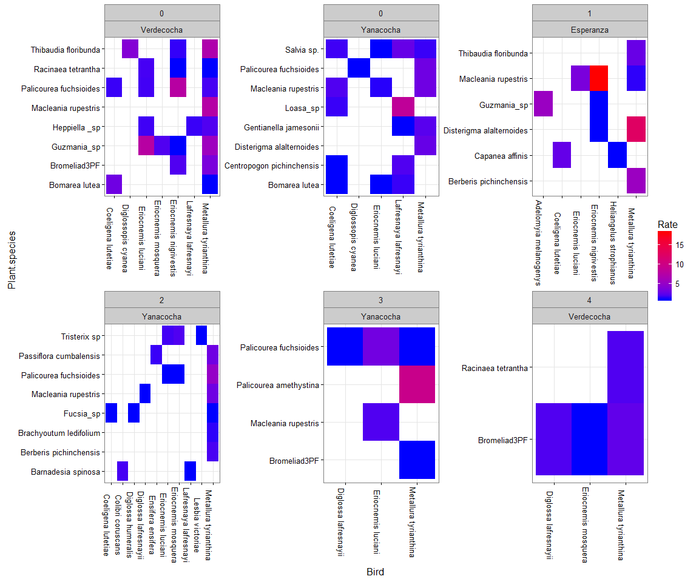

# Hummingbird Deforestation Levels
Ben Weinstein  
July 19, 2016  


```r
#read in packages
library(reshape2)
library(ggplot2)
library(dplyr)
library(bipartite)
```

#Data Collection
We performed our field work on the north-western flanks of the Pichincha volcano, Pichincha
province, north-western Ecuador, covering an altitudinal range of 3,200–3,500 m the study area
lies within the Mindo Important Bird Area (IBA; Freile and Santander 2005). Recent ecosystem classification defines these forests as evergreen high-mountain forest of the northern Andes (MDMQ-Secretaría de Ambiente 2011) We identified flowering plants in five 0.2-1.2 km transects at three different sites: 1) Yanacocha reserve, 2) Verdecocha reserve and 3) Esperanza Hill. All transects were at a minimum distance of 200 m from each other. Details of coordinates, main habitat and dates of field work at each site are provided in Appendix 1. Our field observations were performed at four habitats, namely: 1) large tracts of mature high- Andean forest that herewith we will call Forest Interior (FI), 2) a diffuse forest border that limits with shrubby vegetation embedded in pastureland that we named Forest Borders with Shrubbery vegetation (FBS), 3) a forest border that abruptly limits with large tract of pastureland that we calc Forest Border with Pastures (FBP), 4) a small isolated 0,49 ha Forest Patch (FP) and small 1 ha patch of forest vegetation recovered from 14-year old fire (FR).

# Read in data


```r
#read in data
dat<-read.csv("InputData/InteractionData_Total.csv",sep=";")

#Only ID on birds
dat<-dat %>% filter(!Bird %in% c("Diglossa sp.","Trochilidae","Eriocnemis sp"))

#create timestamp
dat$timestamp<-as.POSIXct(paste(dat$Month,dat$Day,dat$Year,sep="/"),format="%m/%d/%Y")

#group interactions by Bird, Plant, Site, and Degredation Level
sdat<-dat %>% group_by(Bird,Plant.species,Site,DegLev) %>% summarize(Yobs=n(),Days=length(unique(timestamp)))
sdat$Rate<-round(sdat$Yobs/sdat$Days,2)
```

#Data Cleaning


#Visualize data


```r
ggplot(sdat,aes(x=Bird,y=Plant.species,fill=Rate)) + geom_tile() + facet_wrap(DegLev~Site,scales="free",ncol=3) + scale_fill_continuous(low="blue",high="red") + theme_bw() + theme(axis.text.x=element_text(angle=-90))
```

<!-- -->

**Figure 1. Interaction networks based on the daily rate of visitation at each site and degredation level (0-4).**

#Potential Questions
## Does the rate of hummingbird specialization, the proportion of used flowers versus total flowers, change across deforestation levels?
* This would require randomization tests to calculate specialization and compare them to a null   model based on the _diversity_ of plant partners choosen.

## Does the rate of hummingbird visitation change with degredation levels?
* This would reduce the dataset to plants that are represented in multiple levels, i.e:


```r
plantsp<-sdat %>% group_by(Plant.species) %>% summarize(n=length(unique(DegLev))) %>% filter(n>1)
plantsp
```

```
## Source: local data frame [8 x 2]
## 
##              Plant.species     n
##                     (fctr) (int)
## 1   Berberis pichinchensis     2
## 2             Bromeliad3PF     3
## 3 Disterigma alalternoides     2
## 4              Guzmania_sp     2
## 5      Macleania rupestris     4
## 6   Palicourea fuchsioides     3
## 7       Racinaea tetrantha     2
## 8     Thibaudia floribunda     2
```

##Does the rate of trait-matching change across deforestation levels? That is, do species in deforested areas use different resources with respect to their bill lengths?
  + This would require that we have information on bill and corolla lengths. How complete is this list? For all species, regardless of whether they are across mulitple sites.
